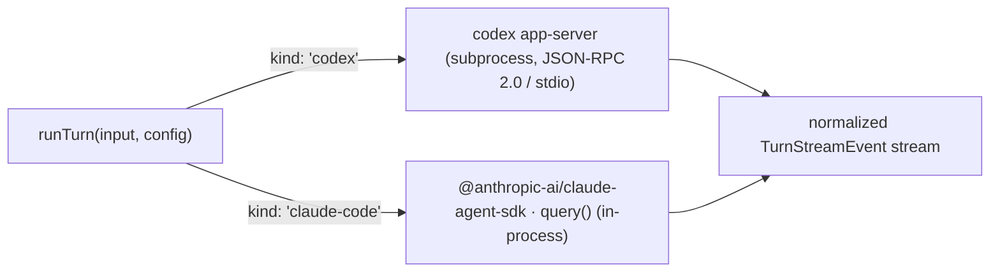

# Agent runtime

Every chat turn, builder iteration, and automation fire needs an actual coding
agent somewhere. `@centraid/agent-runtime` is the local engine layer: it drives
**one turn** through one of two backends and normalizes both to the same
`TurnStreamEvent` stream, so nothing downstream needs to know which engine ran.

The package is wired into the gateway, not called directly by surfaces. The
gateway injects a `ConversationRunner` (for `POST /centraid/<id>/_turn`) and a
fire path (for automations); both bottom out in this package's `runTurn`.

## Two backends, one event stream

`runTurn(input, config)` dispatches on the user's persisted
`agent.runner.kind` pref:

Both backends emit the same event union (`assistant.start`, `assistant.delta`,
`reasoning.delta`, `tool.start`, `tool.result`, `final`, `usage`, `phase`,
`error`, `aborted`). Each returns an opaque `sessionId` (codex thread id /
claude session id); round-trip it on the next turn via `prevSessionId` to
resume.

`runTurn` lives in `packages/agent-runtime/src/runtime.ts`; the dispatch is
`runtime.ts:29-72`.

### codex app-server backend

Spawns `codex app-server` and drives the turn over JSON-RPC 2.0 on stdio:
`initialize` (with `experimentalApi: true`) → `initialized` → `thread/start`
(or `thread/resume`) → `turn/start`. Server notifications
(`item/agentMessage/delta`, `item/started`, `item/completed`,
`turn/completed`, …) are translated into the normalized event stream.

The turn is pinned to `sandbox: 'workspace-write'` and `approvalPolicy:
'never'` so the agent can write files under its `cwd` without prompting. Codex
reads its own auth from `$CODEX_HOME/auth.json` (default `~/.codex/auth.json`)
— Centraid never touches it; the user runs `codex login` once.

See `packages/agent-runtime/src/backends/codex/backend.ts`.

### Claude Agent SDK backend

Imports `@anthropic-ai/claude-agent-sdk` and runs `query()` **in-process** —
no subprocess we manage. `includePartialMessages: true` gives token-level
streaming; `extraSystemPrompt` is appended to the `claude_code` preset prompt.
The SDK reads `ANTHROPIC_API_KEY` from the environment (there is no per-call
auth field). The import is lazy, so a codex-only user never pays the SDK's
load cost.

See `packages/agent-runtime/src/backends/claude/backend.ts`.

## The three structured tools

When the gateway threads a `ToolContext` into a turn, both backends declare
the same three first-class tools — and dispatch them in-process against the
shared `@centraid/app-engine` dispatcher, so the model sees an identical
surface regardless of engine:

| Tool                | Purpose                                                                                                       |
| ------------------- | ------------------------------------------------------------------------------------------------------------- |
| `centraid_describe` | App manifest + live SQLite schema, or a single declared handler entry. Called first to discover what exists.  |
| `centraid_read`     | Invoke a declared query, or `_sql` for an ad-hoc `SELECT`/`EXPLAIN` (rows capped at 200; DDL/PRAGMA refused). |
| `centraid_write`    | Invoke a declared action, or `_sql` for a single `INSERT`/`UPDATE`/`DELETE`/`REPLACE` (DDL/PRAGMA refused).   |

The ad-hoc `_sql` path is an escape hatch _inside_ the dispatcher (`query:
"_sql"` / `action: "_sql"`), not a separate tool. A successful write fires the
runtime's change bus so the app UI re-renders (the `/centraid/<id>/_changes`
stream). Wiring:
`packages/agent-runtime/src/backends/codex/host-tools.ts` (codex
`dynamicTools`) and `packages/agent-runtime/src/backends/claude/host-tools.ts`
(an in-process MCP server).

> Both backends expose `centraid_describe` / `centraid_read` /
> `centraid_write`. The `centraid_sql_*` names that appear in some older
> docs/scripts are stale.

## Model catalog (the chat picker)

The chat model picker is fed by a **gateway-owned catalog** that this package
fills by enumerating each runner's live model list — there is no hardcoded
seed:

- **claude-code** — the Agent SDK's `query().supportedModels()` control method
  (no model turn, no tokens). The CLI reports its built-in aliases (e.g.
  `default`/`sonnet`/`haiku`), each with a display name.
- **codex** — the app-server `model/list` JSON-RPC method. Enumeration mirrors
  the runner's `extraArgs` so a `-c`/profile override surfaces the same models
  the real runner serves.

Enumeration is the `CatalogWarmer`'s job (`models/catalog-warmer.ts`), driven
on **gateway boot** and on **explicit Refresh**. Reads
(`readRunnerModels`/`readRunnerTools` in `models/catalog.ts`) are pure — they
return the cached list or `[]`, never spawn a CLI. A cold catalog yields `[]`,
and `deriveStatus(cachedLen, warming)` maps `(length, in-flight)` to the UI's
`loading` / `ready` / `empty` tri-state. An empty enumeration never clobbers a
prior good entry. See `models/enumerators.ts`.

> A separate provider-agnostic **capability tier** vocabulary (`smart` /
> `balanced` / `fast`, in `models/tiers.ts`) is what automations request via
> `requires.model`, and the claude backend maps those tokens to its CLI
> aliases at turn time (`backend.ts:38-46`). The chat picker itself is fed by
> live enumeration, not the tier list.

## Host-tool catalog (builder grounding)

The same catalog also tracks each runner's **tool surface** — native builtins
plus configured MCP tools — so the builder's grounding block declares
`ctx.tool` calls against tools the host actually exposes. `enumerateHostTools`
(`host-tools.ts`) captures the tool list off the agent's first model request
against a throwaway local endpoint and aborts — zero model tokens:

- **claude** — the Agent SDK is pointed at a loopback server; because claude
  connects MCP asynchronously, the turn is driven in streaming-input mode and
  the user message is held until `mcpServerStatus()` reports every server has
  left `pending` (otherwise MCP tools are under-counted).
- **codex** — `codex exec` runs against the mock-LLM server; codex connects
  `[mcp_servers.*]` synchronously, so the first request already carries the
  full set.

Models and tools refresh on **independent** triggers and are merged into the
same per-runner catalog entry, so one never clobbers the other.

## CLI preflight & agent detection

Two related but distinct checks live in `preflight.ts`:

- **`probeCliAvailability(kind)`** runs `<bin> --version` and reports only
  whether the CLI is runnable — Centraid is **auth-agnostic**, so this never
  inspects keychains, env keys, or auth files (codex and Claude Code each own
  their own auth). It backs `GET /centraid/_agents/status`, which reports
  _each_ agent the gateway host can drive plus its `--version` and catalog.
- **`runPreflight(prefs)`** is the active runner's readiness for
  `GET /centraid/_turn/runner-status`. It reports the version and compares it
  to an empirically-verified minimum (`MIN_VERSIONS`: codex `0.128.0`,
  claude-code `2.1.126`). An older CLI still reports `ok: true` with
  `versionAtLeast: false` so the panel can warn without hard-blocking. It
  attaches the cached model list (a pure catalog read).

Switching the active agent (or its `binPath`) is a `agent.runner.*` pref
change; the preflight cache keys on `kind::binPath` and re-probes on change.

## CLI bin (`centraid`)

The package ships a `centraid` bin (`cli/centraid-cli.ts`) for humans poking at
an app's `data.sqlite` from a shell — `centraid sql describe`, `sql read`,
`sql write`, and `preview snapshot`. It operates relative to the current
working directory (no `--workspace` flag; `cd` into the app's data dir). Agents
do **not** shell out to it for data access — they use the in-process structured
tools above. Builder sessions still want it on PATH for the `preview snapshot`
flow; `defaultCentraidCliDir()` resolves its dist dir.

## Automations

`runAutomation` (`automation/run-automation.ts`) is the local per-fire
orchestrator: it looks up the user-owned automation, runs its handler against a
live dispatch surface, and drives the host agent for `ctx.agent` calls —
in-process via the Claude SDK or as a `codex exec` subprocess. Scheduling
itself is **not** here: the gateway owns an in-process cron scheduler
(`@centraid/automation`'s `InProcessScheduler`); there is no OS scheduler and
no `centraid run-automation` entry point.

## Where to go next

- [Chat](/concepts/chat) — the surface this drives.
- [Gateway](/concepts/gateway) — what injects the runner and owns the catalog.
- [Three-tool dispatcher](/reference/three-tool-dispatcher) — the surface the agent calls.
- [Reference → CLI](/reference/cli) — the `centraid` CLI commands.
