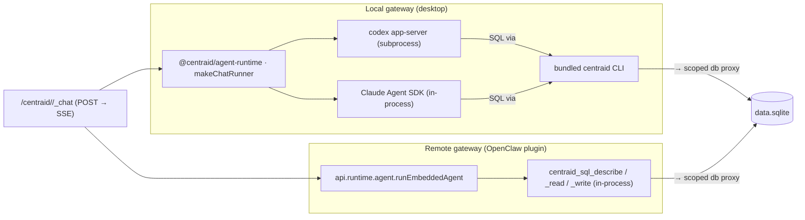

# Agent runtime

The chat surface (and any agent-driven automation) needs an actual engine somewhere. Centraid keeps the surface uniform and lets the _host_ pick the engine.

## The two paths



Both paths end at the same `data.sqlite`, scoped by the same session-key check. The differences are operational.

## OpenClaw embedded agent

When the Centraid gateway runs as an OpenClaw plugin, OpenClaw's own agent infrastructure is right there in-process. The plugin wires up a `ChatRunner` that calls `api.runtime.agent.runEmbeddedAgent` and exposes three SQL tools:

| Tool                    | Purpose                                                                        |
| ----------------------- | ------------------------------------------------------------------------------ |
| `centraid_sql_describe` | Returns `{ tables, views, indexes }` for the calling app.                      |
| `centraid_sql_read`     | Runs one read-only `SELECT`. Multi-statement rejected.                         |
| `centraid_sql_write`    | Runs one `INSERT` / `UPDATE` / `DELETE` / `REPLACE`. DDL and `PRAGMA` refused. |

The `before_tool_call` hook on the plugin parses the chat session key (`centraid-chat:<appId>:w<windowId>`) to enforce that `appId` matches the calling session's app. Cross-app reads/writes and disallowed statement shapes are refused **at the gateway, before `execute` runs**.

Successful writes also flow through `runtime.changeBus`, so subscribers on `/centraid/<appId>/_changes` see the mutation immediately — same as if a regular action had run.

### Enabling the agent tools

Plugin-registered tools don't belong to any built-in OpenClaw tool profile. Enable them in `~/.openclaw/openclaw.json`:

```json
{
  "tools": {
    "profile": "coding",
    "alsoAllow": ["centraid_sql_describe", "centraid_sql_read", "centraid_sql_write"]
  }
}
```

A helper script is shipped to patch the config idempotently:

```sh
node packages/openclaw-plugin/scripts/setup-tools.mjs
```

## Local agent runtime (`@centraid/agent-runtime`)

The desktop gateway doesn't have OpenClaw's agent infra at hand. It uses `makeChatRunner` from `@centraid/agent-runtime`, which drives one of two engines:

### codex app-server

A subprocess running the codex app server. The harness speaks codex's protocol; the agent in the subprocess sees Centraid's tool surface through HTTP (the bundled `centraid` CLI shells back to the gateway).

The steering ledger shows this path was settled after considering MCP plumbing and codex plugins — the conclusion was "CLI-in-prompt over MCP/plugins" (see issue [#71](https://github.com/srikanthsrungarapu/centraid/issues/71)).

### Claude Agent SDK

In-process. The harness imports the SDK and runs the agent loop directly. SQL access still flows through the `centraid` CLI for the same reason — to keep the agent's tool surface identical to the codex path.

### Why a CLI for SQL access

Both engines see SQL access as "run the `centraid` CLI". This is deliberate:

- Same shape regardless of engine — write a prompt once, both engines parse the same tool description.
- The CLI is a thin shim over the same dispatcher the HTTP endpoints hit, so all the validation, change-bus, and session-key enforcement still apply.
- No engine-specific MCP/plugin/tool-registration code to maintain.

## Which engine, when

|               | codex app-server                                                         | Claude Agent SDK                                                      |
| ------------- | ------------------------------------------------------------------------ | --------------------------------------------------------------------- |
| Process model | Subprocess                                                               | In-process                                                            |
| Auth          | Codex's own                                                              | Anthropic API key                                                     |
| Strengths     | Fast iteration on tool prompts; runs offline against local model proxies | Tighter integration with the desktop's process model; no IPC boundary |

> **TODO(#120)** — flesh out the selection criteria. The current docs / receipts justify the _existence_ of both options but not "use codex when X, use Claude SDK when Y". Worth a short stretch from you on the steady-state recommendation.

## Common: the session key enforces scope

Every chat session opens with key `centraid-chat:<appId>:w<windowId>`. Whichever path runs the agent:

- A `before_tool_call` hook (OpenClaw side) or the dispatcher's app-scope check (local side) refuses any tool call whose `app` parameter doesn't match the session's `appId`.
- Refusal happens before the handler runs — there's no chance of partial side effects.

This is what makes "give every app a chat" safe even though every chat sees the same three tools.

## Where to go next

- [Chat](/concepts/chat) — the surface this drives.
- [Three-tool dispatcher](/reference/three-tool-dispatcher) — what the agent calls.
- [Reference → CLI](/reference/cli) — the `centraid` CLI commands the local agent uses.
