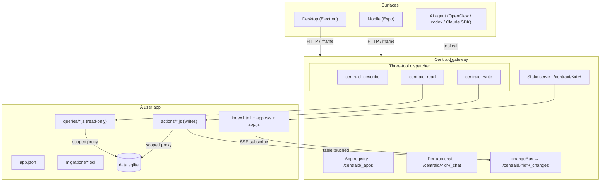

# Architecture

Centraid is one product wearing two shapes: a desktop shell with the gateway embedded in-process, and the same gateway code running remotely as an OpenClaw plugin. Apps are folders. Data is SQLite. AI access goes through three generic tools.

## The big picture

## The five concepts

1. **Gateway** — the process that owns the apps directory, registry, dispatcher, and chat. Runs as the desktop's embedded local runtime _or_ as a remote OpenClaw plugin. Same code, same HTTP surface, same on-disk layout. [Read more →](/concepts/gateway)
2. **App** — a versioned folder of HTML/CSS/JS + handlers, paired with two persistent SQLite files (`data.sqlite` for app data, `runtime.sqlite` for chat sessions + agent run ledger + automation state). Uploaded as a tarball; activated by atomically flipping `current.json#activeVersion`. [Read more →](/concepts/apps)
3. **Queries and actions** — the **tools** an app exposes. Declared in `app.json` (`queries[]` and `actions[]`), implemented in `queries/*.js` and `actions/*.js`. Queries may only read; actions are the only place writes happen. The read/write split is enforced by a governance directive at commit time. [Read more →](/concepts/queries-and-actions)
4. **Change stream** — every action records the tables it touched; the gateway pushes a table-level invalidation on `/centraid/<id>/_changes` (SSE). The app iframe subscribes and re-runs the affected queries. [Read more →](/concepts/change-stream)
5. **Chat and agents** — every app has a `/centraid/<id>/_chat` surface, served identically on both gateway hosts. The runtime exposes the three tools to whichever agent backend the host wired up. [Read more →](/concepts/chat)

## What runs where

| Component       | Desktop (local)                                                     | Remote (OpenClaw plugin)                                    |
| --------------- | ------------------------------------------------------------------- | ----------------------------------------------------------- |
| Gateway process | Electron main                                                       | OpenClaw worker                                             |
| Apps directory  | `~/.centraid/apps/` (default)                                       | `$OPENCLAW_STATE_DIR/centraid/`                             |
| Registry        | `<appsDir>/_registry.json`                                          | `<appsDir>/_registry.json`                                  |
| Chat backend    | `@centraid/agent-runtime` → codex app-server or Claude SDK          | OpenClaw embedded agent                                     |
| Tool surface    | Three-tool dispatcher (HTTP) + bundled `centraid` CLI for agent SQL | Three-tool dispatcher (HTTP) + `centraid_sql_*` agent tools |

The split exists _only_ at the chat backend; the rest of the gateway is byte-identical. That property is what makes "local-first with optional remote" cheap rather than expensive.

## Why this shape

A handful of opinionated decisions hold the design together:

- **Apps are folders, not databases.** A clone is `cp -r`. A version is a tarball. There is no app server framework you need to learn before you can copy one and tweak it.
- **One SQLite per app, persistent across code versions.** Code is versioned; data isn't. You can flip back to an older version of the handlers without losing yesterday's data.
- **Queries can't write.** SQLite tracks mutations on the write path — a sneaky `stmt.run()` inside a query succeeds but is invisible to the change bus, so subscribers go stale with no error. The directive blocks the foot-gun before it ships.
- **Apps expose tools; the dispatcher is a fan-out layer.** Each query and action is a tool with a JSON Schema input contract. The three generic dispatcher tools (`describe / read / write`) let any new app become callable without registering more agent tools. The catalog lives in `app.json`; the dispatcher just routes.
- **Local and remote run the same code.** No "production differs from dev" class of bugs. The legacy "register an external folder live" mode was retired specifically to keep this property — every change goes through upload + version-flip even locally.

## Where to go next

- New to the concepts? Start with [Gateway](/concepts/gateway) and follow the _Read more_ links.
- Want to build an app? Skip to [App anatomy](/build/app-anatomy).
- Looking for the HTTP surface? See [HTTP API](/reference/http-api).
