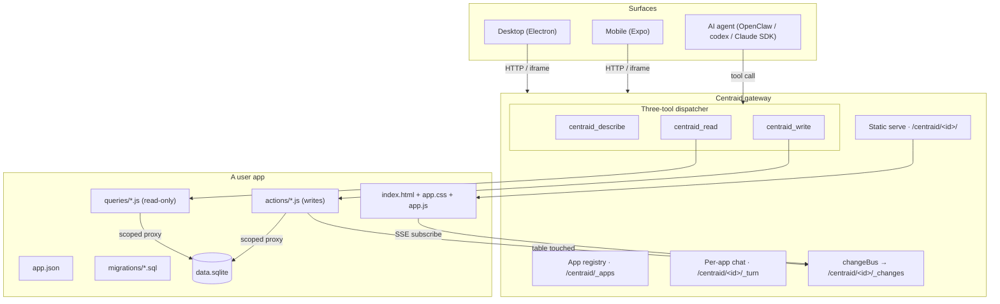

# Architecture

Centraid is one product wearing three shapes: a desktop shell with the gateway embedded in-process, the same gateway code running as the standalone `centraid-gateway` daemon, and the same code again running remotely as an OpenClaw plugin. The desktop is a **thin client** — its renderer talks to the gateway directly over HTTP with a Bearer token, and the gateway owns the whole builder (lifecycle, templates, webhook minting, and the AI chat), so local and remote behave identically. Apps are folders. Data is SQLite. AI access goes through three generic tools.

## The big picture

## The five concepts

1. **Gateway** — the process that owns the apps directory, registry, dispatcher, and chat. Runs as the desktop's embedded local runtime _or_ as a remote OpenClaw plugin. Same code, same HTTP surface, same on-disk layout. [Read more →](/concepts/gateway)
2. **App** — a versioned folder of HTML/CSS/JS + handlers, paired with two persistent SQLite files (`data.sqlite` for app data, `runtime.sqlite` for the per-app conversation ledger + automation state). Code lives in a git store; publishing fast-forward-merges a draft onto `main`. [Read more →](/concepts/apps)
3. **Queries and actions** — the **tools** an app exposes. Declared in `app.json` (`queries[]` and `actions[]`), implemented in `queries/*.js` and `actions/*.js`. Queries may only read; actions are the only place writes happen. The read/write split is enforced by a governance directive at commit time. [Read more →](/concepts/queries-and-actions)
4. **Change stream** — every action records the tables it touched; the gateway pushes a table-level invalidation on `/centraid/<id>/_changes` (SSE). The app iframe subscribes and re-runs the affected queries. [Read more →](/concepts/change-stream)
5. **Chat and agents** — every app has one `/centraid/<id>/_turn` surface that does **both jobs**: editing the app's code and operating its data. The gateway runs the turn in the app's draft worktree with the union of the agent backend's native file tools and the three-tool `centraid_*` dispatcher, so a single chat can rewrite a handler _and_ answer a data question. Code edits stage in the draft (previewable before Publish); Publish is the explicit flip. Served identically on both gateway hosts. [Read more →](/concepts/chat)

## What runs where

| Component       | Desktop (local embed)                                      | Standalone daemon                    | Remote (OpenClaw plugin)                                                 |
| --------------- | ---------------------------------------------------------- | ------------------------------------ | ------------------------------------------------------------------------ |
| Gateway process | Electron main (`serve()`)                                  | `centraid-gateway serve` (`serve()`) | OpenClaw worker (`buildGateway()` composed handler)                      |
| Apps data dir   | `<userData>/gateways/<id>/apps/`                           | `<dataDir>/apps/`                    | `centraid` under the OpenClaw state dir (default `~/.openclaw/centraid`) |
| App code        | per-gateway git store (`code-store/`)                      | git store under `<dataDir>`          | git store siblings to `appsDir`                                          |
| Registry        | `<appsDir>/_registry.json`                                 | `<appsDir>/_registry.json`           | `<appsDir>/_registry.json`                                               |
| Chat backend    | `@centraid/agent-runtime` → codex app-server or Claude SDK | same                                 | OpenClaw embedded agent                                                  |
| Tool surface    | Three-tool dispatcher (`centraid_describe`/`read`/`write`) | same                                 | same three tools, registered as OpenClaw agent tools                     |

All three run the same gateway code; the rest of the gateway is byte-identical. That property is what makes "local-first with optional remote" cheap rather than expensive — and a governance directive (`gateway-engine-mode-agnostic`) forbids `app-engine` from branching on which host it's in.

## Why this shape

A handful of opinionated decisions hold the design together:

- **Apps are folders, not databases.** A clone copies the file tree. There is no app server framework you need to learn before you can copy one and tweak it.
- **Code lives in a git store; data lives outside it.** App code is versioned in a git store — a draft is a session branch, and Publish fast-forward-merges it onto `main`. The per-app SQLite files (`data.sqlite`, `runtime.sqlite`) sit in a stable data dir outside any worktree, so a version swap never touches yesterday's data.
- **Queries can't write.** SQLite tracks mutations on the write path — a sneaky `stmt.run()` inside a query succeeds but is invisible to the change bus, so subscribers go stale with no error. A governance directive blocks the foot-gun before it ships.
- **Apps expose tools; the dispatcher is a fan-out layer.** Each query and action is a handler with a JSON Schema input contract. The three generic dispatcher tools (`describe / read / write`) let any new app become callable without registering more agent tools. The catalog lives in `app.json`; the dispatcher just routes.
- **All deployments run the same code.** No "production differs from dev" class of bugs — embedded, daemon, and OpenClaw share one gateway. The `gateway-engine-mode-agnostic` directive keeps it that way by forbidding `app-engine` from branching on its host.

## Where to go next

- New to the concepts? Start with [Gateway](/concepts/gateway) and follow the _Read more_ links.
- Curious how the desktop reaches local _and_ remote gateways? See [IPC vs HTTP](/concepts/ipc-vs-http).
- Want to build an app? Skip to [App anatomy](/build/app-anatomy).
- Looking for the HTTP surface? See [HTTP API](/reference/http-api).
