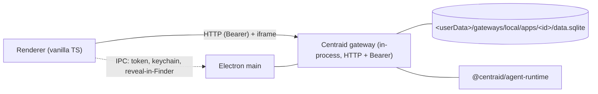

# Local deploy

There are two ways to run Centraid locally, both serving the same gateway code over HTTP:

- **Embedded in the desktop** (the default) — the gateway runs inside the Electron main process. Launch with `bun run dev:desktop`; nothing else to install or start.
- **As the `centraid-gateway` daemon** — a standalone process with its own `dataDir`, for headless or always-on use.

In both, the gateway speaks HTTP behind a Bearer token. The desktop renderer is a [thin client](/concepts/ipc-vs-http): it issues authenticated `fetch`es to the embedded gateway exactly as it would to a remote one, and app iframes load from `/centraid/<id>/`.

## What's running (desktop embed)



The renderer reaches the gateway over **HTTP**, not IPC — IPC is reserved for genuinely native operations (token bridge, keychain, reveal-in-Finder, gateway lifecycle). See [IPC vs HTTP](/concepts/ipc-vs-http).

The gateway code is the same that runs as the OpenClaw plugin remotely. The local-vs-remote difference shows up only in the chat backend (local: `@centraid/agent-runtime` → codex or Claude SDK; remote: OpenClaw embedded agent) and the host-derived paths. See [Architecture → what runs where](/concepts/architecture#what-runs-where).

## On-disk layout (desktop embed)

The desktop hosts one local gateway (fixed id `local`) plus 0..N remote gateways. Every file belonging to a gateway lives under `<userData>/gateways/<id>/` (`packages/gateway/.../apps/desktop/src/main/gateway-paths.ts`):

```
<userData>/gateways/local/
├── profile.json            # id, kind, label, url, createdAt
├── token.bin               # encrypted bearer
├── code-store/             # git store owning app CODE (apps.git + worktrees)
├── apps/                   # app DATA, outside any worktree
│   └── <appId>/
│       ├── data.sqlite     # app-owned data (migrations apply here)
│       ├── runtime.sqlite  # per-app conversation ledger + automation state
│       └── blobs/<hash>    # content-addressed attachments
├── identity.sqlite         # users + prefs
├── analytics.sqlite        # one run summary per run
├── chat-runner-sessions/   # codex thread state
├── templates-cache/        # downloaded remote-template tarballs
└── model-catalog.json
```

App **code** is versioned in `code-store/` (a git store: a draft is a session branch, Publish fast-forward-merges onto `main`). App **data** stays under `apps/<appId>/` so a version swap never touches it. The app registry is `<appsDir>/_registry.json`.

## The standalone daemon

```sh
centraid-gateway serve --data-dir ./gw-data --host 127.0.0.1 --port 8765
```

The daemon lays out a flatter tree under `<dataDir>` — `apps/`, `identity.sqlite`, `analytics.sqlite`, `conversation-runner-sessions/`, `model-catalog.json`, and a persistent `token.bin` (mode 0600). It binds loopback by default; pass `--host 0.0.0.0` for LAN. There is no TLS in v0 — front it with Caddy / Tailscale Funnel / Cloudflare Tunnel if exposing beyond a trusted LAN. See [CLIs → centraid-gateway](/reference/cli).

## Why embed the gateway in the desktop

Centraid's local-first design choice. Folding the gateway into Electron's main process gives you:

- **No port to expose** for the common case. No "did you remember to firewall localhost".
- **No second process to supervise.** Restart the desktop, restart everything.
- **Same code as remote.** The renderer issues the same authenticated `fetch` whether the gateway is the embedded local one or a remote OpenClaw plugin — no "production differs from dev" class of bugs.

## When to switch to remote

The local gateway is right for personal use on one machine, and for building/testing apps. You want a remote gateway ([OpenClaw plugin](/deploy/openclaw-plugin)) — or the always-on daemon — when:

- Apps need to be reachable from a phone or a different machine.
- A team or family wants to share apps.
- You need scheduled work to run when the laptop is closed. The desktop's scheduler runs in the Electron main process; cron triggers fire only while the desktop app is running. Webhook triggers don't fire on the desktop at all — they exist on remote/daemon gateways that are reachable HTTP hosts.

## Mobile companion

The Expo mobile app embeds no gateway. It connects over HTTP to either a paired local gateway (LAN) or a remote one.

## Where to go next

- [Remote deploy (OpenClaw plugin)](/deploy/openclaw-plugin) — same gateway, remote host.
- [IPC vs HTTP](/concepts/ipc-vs-http) — the thin-client split.
- [CLIs](/reference/cli) — the `centraid` and `centraid-gateway` bins.
