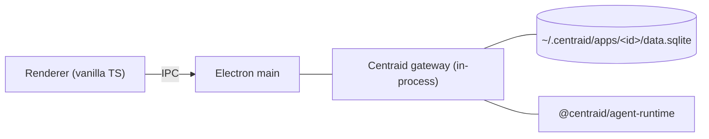

# Local deploy (desktop)

The default. When you launch the desktop app with `bun run dev:desktop`, the Centraid gateway runs **inside the Electron main process**. The renderer talks to it directly over HTTP with a Bearer token (the desktop is a [thin client](/concepts/ipc-vs-http)); app iframes load from the in-process gateway as if it were a remote URL.

Nothing else to install. Nothing else to start.

## What's running



The gateway code is the same code that runs as the OpenClaw plugin remotely. The local-vs-remote difference shows up only in:

- The chat backend (local: `@centraid/agent-runtime` → codex or Claude SDK; remote: OpenClaw embedded agent).
- The `appsDir` default.

See [Architecture → what runs where](/concepts/architecture#what-runs-where) for the side-by-side table.

## Apps directory

Default: `~/.centraid/apps/<id>/`.

> **TODO(#120)** — confirm the default `appsDir` for the local gateway. The plugin's documented default is `centraid` under `$OPENCLAW_STATE_DIR`; the local desktop almost certainly uses something different. Trace `apps/desktop/src/main/` to find the resolved path.

The layout matches the gateway concept:

```
~/.centraid/apps/
├── _registry.json
└── <id>/
    ├── data.sqlite
    ├── current.json
    ├── versions/
    │   └── v_…/
    └── _chat/
        ├── w<windowId>.jsonl
        └── index.json
```

## Why this isn't a separate server

Centraid's local-first design choice. Folding the gateway into Electron's main process gives you:

- **No port to expose.** No "did you remember to firewall localhost".
- **No second process to supervise.** Restart the desktop, restart everything.
- **IPC instead of HTTP for the renderer.** Lower latency, easier auth (the renderer is trusted code in the same process tree).
- **Same code as remote.** The legacy "register an external folder live" mode was retired specifically to keep local and remote behaving identically.

## When to switch to remote

The local gateway is right for:

- Personal use, one user, one machine.
- Building and testing apps before publishing them.
- "I want my data to stay on this laptop."

You want remote ([OpenClaw plugin](/deploy/openclaw-plugin)) when:

- Apps need to be reachable from a phone or a different machine.
- A team or family wants to share apps.
- You need scheduled work to run when the laptop is closed. The desktop's scheduler runs in the Electron main process; cron triggers fire only while the desktop app is running. Webhook triggers don't fire on the desktop at all (the desktop is a gateway client, not an HTTP host) — they exist on remote gateways only.

## Mobile companion

The Expo mobile app does not embed a gateway. It connects over HTTP to either a paired local gateway (LAN) or a remote one.

> **TODO(#120)** — document the pairing flow. The mobile app needs to know either the local gateway's LAN URL or the remote OpenClaw URL; the desktop must expose its local gateway over LAN to make this work. The receipts mention mobile-related issues but not the pairing UX.

## Where to go next

- [Remote deploy (OpenClaw plugin)](/deploy/openclaw-plugin) — same gateway, remote host.
- [SQLite layout](/deploy/sqlite-layout) — what's on disk and what survives a restart.
- [Gateway](/concepts/gateway) — the underlying concept.
