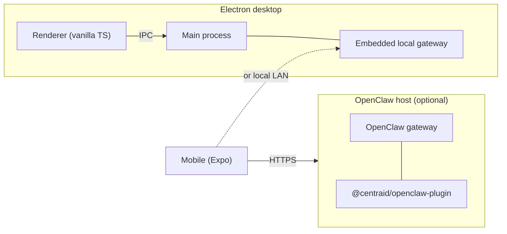

# Getting started

Centraid ships as a monorepo. The desktop app embeds a local gateway out of the box — no separate server to run. The same gateway code can also be mounted on an OpenClaw instance to host apps remotely; the two modes share one upload-and-version-flip contract.

## Prerequisites

- **Bun** `>= 1.3.x` — install from [bun.sh](https://bun.sh). Centraid pins `bun@1.3.13` in `package.json#packageManager`.
- **Node** `>= 24` (recommended) for built-in `node:sqlite`. Node `22.5` – `23.x` works behind `--experimental-sqlite`.
- **macOS, Linux, or Windows** for the desktop shell.
- **Xcode** (iOS) or **Android Studio** (Android) only if you plan to build the mobile companion to a device.

## Install

```sh
git clone https://github.com/srikanthsrungarapu/centraid.git
cd centraid
bun install
```

## Run the desktop app

```sh
bun run dev:desktop
```

This invokes `turbo run dev --filter=@centraid/desktop`. The Electron shell launches with the local gateway embedded in the main process; the renderer connects to it over IPC. App iframes load from the in-process gateway at `/centraid/<id>/`.

## Run the mobile companion

```sh
bun run dev:mobile
```

Starts the Expo dev server. The mobile app talks to a Centraid gateway over HTTP — it does not embed one of its own.

> **TODO(#120)** — confirm whether mobile defaults to a paired desktop's gateway or requires a remote gateway URL, and document the pairing flow. The steering ledger references mobile work but I haven't read the pairing code.

## Build and check

```sh
bun run build        # turbo run build (all apps + packages)
bun run typecheck    # TypeScript across the workspace
bun run check        # oxfmt --check + oxlint
bun run ci           # what CI runs: check + typecheck
```

## What's running where



Both gateways speak the same `/centraid/_apps/*`, `/centraid/_tool/*`, and `/centraid/<id>/*` surfaces. See [Architecture](/concepts/architecture) for the full breakdown.

## Next steps

<Columns>
  <Card title="Quickstart" href="/quickstart" icon="rocket">
    Clone a template and watch it light up.
  </Card>
  <Card title="What's an app?" href="/concepts/apps" icon="package">
    The folder shape, the lifecycle, the data isolation model.
  </Card>
</Columns>
