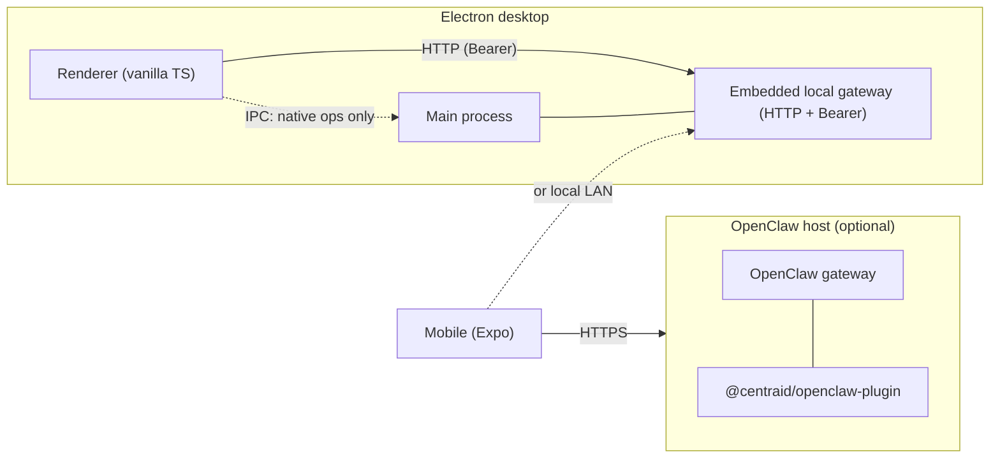

# Getting started

> **Your apps. Your data. Your devices.**

**Centraid turns your [OpenClaw](/deploy/openclaw-plugin) into a personal app store.** Tiny, single-purpose apps that live on your own server and show up on your devices.

OpenClaw is messaging-first — you talk to it from WhatsApp, Telegram, Slack, wherever you already chat. That's perfect for one-line jobs: "log my weight", "what's on my calendar?", "remind me at 7pm".

Some things don't fit in a sentence. You want to _see_ them — a month of expenses, your habit grid, last week's runs on a map, the photos from the trip. For those, a glance beats a paragraph and tapping beats typing.

Centraid is the rich-UI layer for those. Same OpenClaw underneath — your connections, your agents, your data — with a screen wrapped around the apps that need one.

Two AI helpers come built in:

- **One uses your apps for you** — ask in plain language, it works the buttons.
- **One makes apps just for you** — describe a new app or a change to an existing one, and it ships it. No code needed.

Under the hood, both helpers use the same buttons you do — so anything you can do in the UI, the AI can do too, and the other way around. The rest of this page is the developer setup; if you just want to try it, [start at the Quickstart](/quickstart).

Centraid ships as a monorepo. The desktop app embeds a local gateway out of the box — no separate server to run. The same gateway code can also be mounted on an OpenClaw instance to host apps remotely; the two modes share one upload-and-version-flip contract.

## Prerequisites

- **Bun** `>= 1.3.x` — install from [bun.sh](https://bun.sh). Centraid pins `bun@1.3.13` in `package.json#packageManager`.
- **Node** `>= 24` (recommended) for built-in `node:sqlite`. Node `22.5` – `23.x` works behind `--experimental-sqlite`.
- **macOS, Linux, or Windows** for the desktop shell.
- **Xcode** (iOS) or **Android Studio** (Android) only if you plan to build the mobile companion to a device.

## Install

```sh
git clone https://github.com/srikanthsrungarapu/centraid.git
cd centraid
bun install
```

## Run the desktop app

```sh
bun run dev:desktop
```

This invokes `turbo run dev --filter=@centraid/desktop`. The Electron shell launches with the local gateway embedded in the main process; the renderer connects to it directly over HTTP with a Bearer token (the desktop is a [thin client](/concepts/ipc-vs-http)). App iframes load from the in-process gateway at `/centraid/<id>/`.

## Run the mobile companion

```sh
bun run dev:mobile
```

Starts the Expo dev server. The mobile app talks to a Centraid gateway over HTTP — it does not embed one of its own. Point it at a paired local gateway over LAN, or at a remote OpenClaw/daemon gateway URL.

## Build and check

```sh
bun run build        # turbo run build (all apps + packages)
bun run test         # turbo run test (per-package vitest)
bun run typecheck    # TypeScript across the workspace
bun run check        # oxfmt --check + oxlint
bun run ci           # what CI runs: check + typecheck + lint:types
```

## What's running where



Both gateways speak the same `/centraid/_apps/*`, `/centraid/_tool/*`, and `/centraid/<id>/*` surfaces. See [Architecture](/concepts/architecture) for the full breakdown.

## Next steps

<Columns>
  <Card title="Quickstart" href="/quickstart" icon="rocket">
    Clone a template and watch it light up.
  </Card>
  <Card title="What's an app?" href="/concepts/apps" icon="package">
    The folder shape, the lifecycle, the data isolation model.
  </Card>
</Columns>
