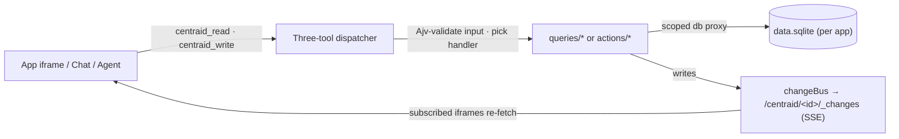

# Centraid

> Your apps. Your data. Your device — or your server.

**Centraid is a personal app builder.** Author tiny single-purpose apps as folders of HTML, CSS, JS, and a SQLite database, then run them inside the Centraid **desktop shell**, alongside a **mobile companion**, or on a **remote gateway** mounted as an OpenClaw plugin. The same upload-and-flip contract works in all three places.

<Columns>
  <Card title="Quickstart" href="/quickstart" icon="rocket">
    Clone a template, open the app, change a value — in five minutes.
  </Card>
  <Card title="Architecture" href="/concepts/architecture" icon="layout-dashboard">
    How the gateway, apps, handlers, and chat fit together.
  </Card>
  <Card title="Build an app" href="/build/app-anatomy" icon="hammer">
    File layout, queries, actions, migrations, change streams.
  </Card>
  <Card title="API reference" href="/reference/three-tool-dispatcher" icon="terminal">
    The three-tool dispatcher and the full `/centraid/*` HTTP surface.
  </Card>
</Columns>

## What you get

- **Apps as folders.** An app is `index.html` + `app.css` + `app.js` + `queries/*.js` + `actions/*.js` + `migrations/*.sql` + `app.json`. Nothing else.
- **Apps expose tools.** Each query and action is a **tool** — declared in `app.json` with a name, description, input/output JSON Schemas, and side-effect annotations. Your UI, an AI agent, and the CLI all see the same tool catalog.
- **One SQLite per app.** Data persists across code versions. Tool implementations get a scoped DB proxy; nothing leaks across apps.
- **Read/write split enforced.** Query tools can only read; action tools are the only place writes happen. A governance directive blocks the foot-gun at commit time.
- **Live data, no plumbing.** Every action invalidates the tables it touched and pushes an event on `/centraid/<id>/_changes`. Subscribed iframes re-fetch automatically.
- **One calling convention.** Three generic dispatcher tools (`centraid_describe`, `centraid_read`, `centraid_write`) fan out to every app's tool catalog — exposed both as OpenClaw agent tools and as HTTP endpoints. AI agents and your UI use the same surface.
- **Automations are first-class.** Apps can carry `automations/<id>/` directories — each one a manifest plus a generated handler — that fire on a cron schedule or an inbound webhook. The bundled `auto.*` templates are headless automation apps (no `index.html`).
- **Run anywhere.** Local: embedded in the Electron desktop. Remote: as the `@centraid/openclaw-plugin` on an OpenClaw gateway. Identical contract.

## How a request flows

## Where to start

<Columns>
  <Card title="Get started" icon="play" href="/getting-started">
    Install Centraid, run the desktop shell, pair the mobile app.
  </Card>
  <Card title="Concepts" icon="lightbulb" href="/concepts/architecture">
    Gateway, apps, automations, chat, agent runtimes — what each is and why.
  </Card>
  <Card title="Templates" icon="grid" href="/templates/index">
    Clone-and-deploy starting points: Hydrate, Todos, Journal, plus the automation pack.
  </Card>
  <Card title="Deploy" icon="cloud-upload" href="/deploy/local">
    Local-only desktop, or remote via the OpenClaw plugin.
  </Card>
</Columns>
