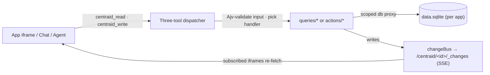

# Centraid

> **Your apps. Your data. Your devices.**

**Centraid turns your [OpenClaw](/deploy/openclaw-plugin) into a personal app store.** Tiny, single-purpose apps that live on your own server and show up on your devices.

OpenClaw is messaging-first — you talk to it from WhatsApp, Telegram, Slack, wherever you already chat. That's perfect for one-line jobs: "log my weight", "what's on my calendar?", "remind me at 7pm".

Some things don't fit in a sentence. You want to _see_ them — a month of expenses, your habit grid, last week's runs on a map, the photos from the trip. For those, a glance beats a paragraph and tapping beats typing.

Centraid is the rich-UI layer for those. Same OpenClaw underneath — your connections, your agents, your data — with a screen wrapped around the apps that need one.

Two AI helpers come built in:

- **One uses your apps for you.** Ask in plain language — "log today's weight", "what did I spend this week?" — and it works the buttons.
- **One makes apps just for you.** Describe a new app or a change to an existing one — "track my reading", "add a notes field", "show me a weekly chart" — and it ships the change. No code to write yourself.

Start with what's in the box, clone a template, or ask for something new — then keep shaping it as you go.

<Columns>
  <Card title="Quickstart" href="/quickstart" icon="rocket">
    Clone a template, open the app, change a value — in five minutes.
  </Card>
  <Card title="Architecture" href="/concepts/architecture" icon="layout-dashboard">
    How the gateway, apps, handlers, and chat fit together.
  </Card>
  <Card title="Build an app" href="/build/app-anatomy" icon="hammer">
    File layout, queries, actions, migrations, change streams.
  </Card>
  <Card title="API reference" href="/reference/three-tool-dispatcher" icon="terminal">
    The three-tool dispatcher and the full `/centraid/*` HTTP surface.
  </Card>
</Columns>

## What you get

**Think of it like Notion — but for whole apps, not pages.** A workspace of your own, stocked with small purpose-built apps you can use, change, or have an AI build for you.

- **Apps that work on their own.** Automations let an app keep running in the background — fire on a schedule, react to an email, run when something happens online. Some apps are nothing but an automation: a job, no screen.
- **AI built in, not bolted on.** A chat AI uses your apps for you. A builder AI creates and customizes them — add a field, change a chart, sketch a whole new app from a sentence.
- **Nothing to connect inside Centraid.** Your Slack, Gmail, calendar, GitHub — already wired into OpenClaw. Every Centraid app inherits those connections. No accounts to set up, no passwords for Centraid to store.
- **Apps that remember you.** Each app keeps its own chat history and a log of what its automations did — locally, on your device, not on a server.
- **Your data, your devices.** Each app keeps its own data on your machine. Nothing leaks between apps, nothing leaves your devices unless you say so.
- **One app, everywhere.** Desktop, mobile, or a server you own — same app, same data, same way to use it.

## Under the hood

For builders and tinkerers — the technical structure that makes the rest possible.

- **Apps as folders.** _Source tree:_ `index.html` + `app.css` + `app.js` + `queries/*.js` + `actions/*.js` + `migrations/*.sql` + `automations/<id>/` + `app.json`. Code is versioned in a per-gateway **git store**; the app's per-app `data.sqlite` and `runtime.sqlite` live in a stable data dir alongside, outside any worktree.
- **Apps expose tools.** Each query and action is a **handler** — declared in `app.json` with a name, description, input/output JSON Schemas, and (for actions) a `writes:` table list. Your UI, an AI agent, and the dispatcher all see the same catalog.
- **Two SQLite files per app.** `data.sqlite` holds app-owned data (migrations apply here); `runtime.sqlite` holds the app's per-app conversation ledger (`conversations ⊃ turns ⊃ items`) plus automation state. Both persist across code versions. Handlers get a scoped DB proxy onto `data.sqlite`; nothing leaks across apps.
- **Versioned code, clean publish.** A draft is a session branch in the git store; **Publish** fast-forward-merges it onto `main`, and the runtime serves handlers + static files from the live `main` worktree. The SQLite files are untouched by a version swap.
- **Read/write split enforced.** Query tools can only read; action tools are the only place writes happen. A governance directive blocks the foot-gun at commit time.
- **Live data, no plumbing.** Every action invalidates the tables it touched and pushes an event on `/centraid/<id>/_changes`. Subscribed iframes re-fetch automatically.
- **One calling convention.** Three generic dispatcher tools (`centraid_describe`, `centraid_read`, `centraid_write`) fan out to every app's tool catalog — exposed both as OpenClaw agent tools and as HTTP endpoints. AI agents and your UI use the same surface.
- **Automations are first-class apps.** Apps can carry `automations/<id>/` directories — each one a manifest plus a generated handler — that fire on a cron schedule or an inbound webhook. Standalone automations are headless apps: same structure, same lifecycle, no `index.html`. The bundled automation templates ship that way.
- **Run anywhere.** Local: embedded in the Electron desktop, or as the standalone `centraid-gateway` daemon. Remote: as the `@centraid/openclaw-plugin` on an OpenClaw gateway. Identical contract on all three.

### How a request flows

## Where to start

<Columns>
  <Card title="Get started" icon="play" href="/getting-started">
    Install Centraid, run the desktop shell, pair the mobile app.
  </Card>
  <Card title="Concepts" icon="lightbulb" href="/concepts/architecture">
    Gateway, apps, automations, chat, agent runtimes — what each is and why.
  </Card>
  <Card title="Templates" icon="grid" href="/templates/index">
    Clone-and-deploy starting points: Hydrate, Todos, Journal, plus the automation pack.
  </Card>
  <Card title="Deploy" icon="cloud-upload" href="/deploy/local">
    Local-only desktop, or remote via the OpenClaw plugin.
  </Card>
</Columns>
